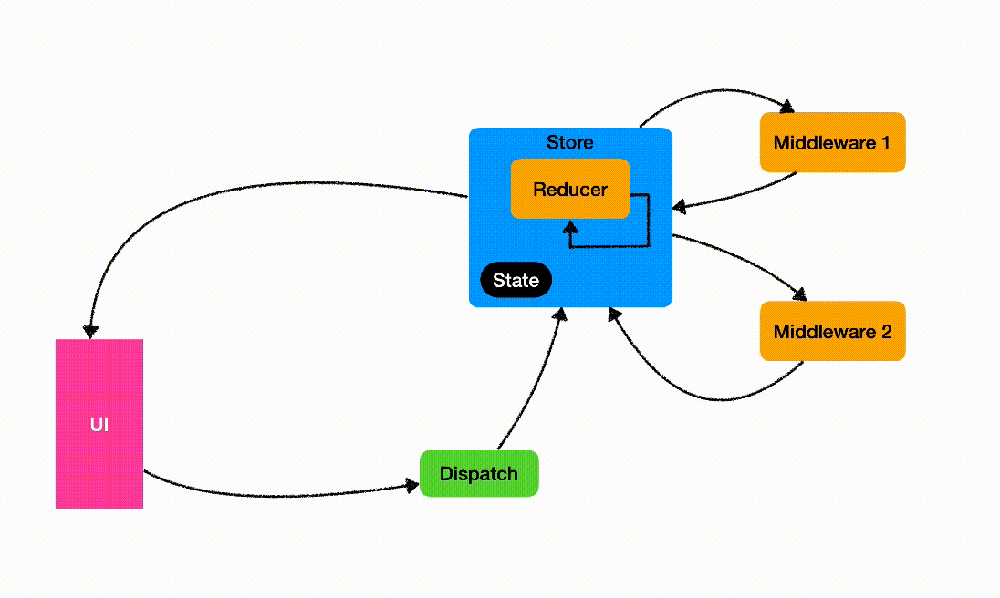

# Highway - create more product value in less time

Highway is an Redux-like architecture pattern implementation with Swift.


## Table of contents

- [Features](#features)
- [Tutorials](#tutorials)
- [Examples](#examples)
- [Requirements](#requirements)
- [Installation (Cocoapods / SPM)](#installation-cocoapods--spm)
- [Schemes](#schemes)
- [Alternatives](#alternatives)
- [Tools used in project](#tools-used-in-project)
- [Author](#author)
- [Credits and thanks](#credits-and-thanks)

## Features

- Child stores
- Fast state updates
- 100% business logic code coverage
- Lightweight
- Do not use 3rd party libraries
- Can be used with SwiftUI
- Support structs & classes for state (structs preferred)
- Thread safe

## Tutorials
[Basic step by step guide](Docs/BusinessLogic.md)

## Examples

#### Integration
- [Cocoapods integration](https://github.com/cooler333/Highway/tree/main/Examples/PodExample)
- [Swift Package Manager integration](https://github.com/cooler333/Highway/tree/main/Examples/SPMExample)

#### Swift UI
- [SimpleView](https://github.com/cooler333/Highway/blob/main/Examples/Counter/Counter/UILayer/Main/View/MainView.swift): SwiftUI View with updates
- [ListWithAimations](https://github.com/cooler333/Highway/blob/main/Examples/Animation/Animation/UILayer/Root/SwiftUIView/RootView.swift): Data Driven UI using SwiftUI List 

#### Tests
- [Snapshot testing](https://github.com/cooler333/Highway/tree/main/Examples/InfiniteScroll/InfiniteScrollTests/Stories/Mail/SnapshotListTests.swift): Snapshot tests based on fast unit tests
- [Unit testing business logic](https://github.com/cooler333/Highway/tree/main/Examples/InfiniteScroll/InfiniteScrollTests/Stories/Mail/LogicListTests.swift): Custom logic tests / Integration tests for Model Layer

#### Light/Small Apps
- [Counter](https://github.com/cooler333/Highway/tree/main/Examples/Counter): Lighweight multi store app (Single view controller with multiple child view controller)
- [SocketPingPong](https://github.com/cooler333/Highway/tree/main/Examples/SocketPingPong): An app with stream of events (like web socket or server side events)
- [ReusableViewControllers](https://github.com/cooler333/Highway/tree/main/Examples/ReusableViewControllers): Reuse view controller or view which was written with imperative style and simmilar example using ViewStore
- [Animation](https://github.com/cooler333/Highway/tree/main/Examples/Animation): Animation inside TableView cells using DiffableDataSource & SwiftUI List views(items)
- [TableViewsSync](https://github.com/cooler333/Highway/tree/main/Examples/TableViewsSync): TableView with animations (deletions/insertions) and syncronisation

#### Heavy Apps
- [InfiniteScroll](https://github.com/cooler333/Highway/tree/main/Examples/InfiniteScroll): Enterprise solution app (with Dependency Injection, Flow Coordinator e.t.c.)

https://user-images.githubusercontent.com/2772537/177874199-1ba154f8-7982-4016-8618-dc59f76a5d6f.mov

## Requirements

- iOS: 13.0
- Swift: 5.4

## Installation (Cocoapods / SPM)

Highway is available through [CocoaPods](https://cocoapods.org). To install
it, simply add the following line to your Podfile:

```ruby
pod 'Highway'
```

Also you can integrate framework as SPM package

## Schemes

#### Simple unidirectional data flow



1. UI generate Action
1. Action goes to Store
1. Store mutate State (if needed)
1. new State goes to UI
1. Action goes to Middleware
1. Middleware generate new action (if needed)
1. new Action from Middleware goes to Store
1. Store mutate State (if needed)
1. new State goes to UI

#### Single shared state


- Multiple Stores share single State
- State not copied for each new SubStore
- State mutation goes down to parent store

## Alternatives

- [Mobius.swift](https://github.com/spotify/Mobius.swift)
- [ReSwift](https://github.com/ReSwift/ReSwift)
- [ReCombine](https://github.com/ReCombine/ReCombine)
- [Swift Composable Architecture](https://github.com/pointfreeco/swift-composable-architecture)
- [Tea In Swift](https://github.com/chriseidhof/tea-in-swift)
- [SwiftRex](https://github.com/SwiftRex/SwiftRex)
- [Katana](https://github.com/BendingSpoons/katana-swift)
- [ReactorKit](https://github.com/ReactorKit/ReactorKit)
- [Tempura](https://github.com/BendingSpoons/tempura-swift)
- [RxFeedback](https://github.com/NoTests/RxFeedback.swift)
- [More](https://github.com/onmyway133/awesome-ios-architecture#unidirectional-data-flow)

## Tools used in project

- [rbenv](https://github.com/rbenv/rbenv): Manage your app's Ruby environment (quote from rbenv github web page)
- [Bundler](https://bundler.io): The best way to manage a Ruby application's gems (quote form Bundler web page)
- [Git LFS](https://git-lfs.github.com): An open source Git extension for versioning large files (quote from git-lfs web page)

## TODO

1. App tests examples (UI test using KIF)
1. UIView modules (separated frameworks)
1. Add pros and cons to alternatives
1. Improve readme
1. Collapsable UITableView (?)
1. Modern CollectionView (?)
1. Selectors to observe nested values
1. Selectors to map state values 

## Author

Dmitrii Cooler, coolerov333@gmail.com

## Credits and thanks

The following people gave feedback on the library at its early stages and helped make the library what it is today:

Special thanks to:

- [Aleksey Alekseev](https://github.com/joyalex) who helped me to imporve library peformance
- [Dmitii Bobrov](https://github.com/dimabobrov) with major feedback on early concepts 

## License

Highway is available under the MIT license. See the LICENSE file for more info.
