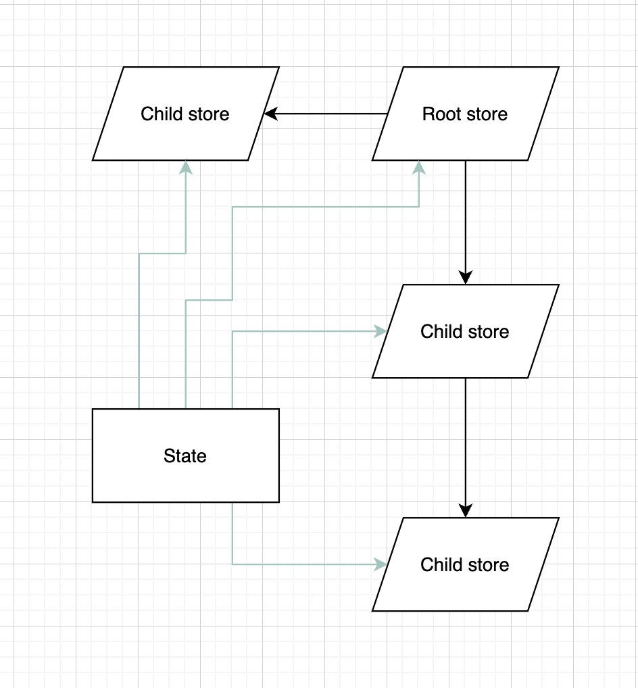

# Highway

Highway is an implementation of Redux-like architecture pattern using Swift.

## Features

- Child stores
- Fast state updates
- 100% business logic code coverage
- Lightweight
- Do not use 3rd party libraries
- Can be used with SwiftUI
- Support structs & classes for state (structs preferred)

## Examples

- [Counter](https://github.com/cooler333/Highway/tree/main/Examples/Counter): Lighweight multi store app (Single view controller with multiple child view controller)
- [SwiftUI](https://github.com/cooler333/Highway/blob/main/Examples/Counter/Counter/UILayer/Main/View/MainView.swift): SwiftUI View with updates
- [SocketPingPong](https://github.com/cooler333/Highway/tree/main/Examples/SocketPingPong): An app with stream of events (like web socket or server side events)
- [ReusableViewControllers](https://github.com/cooler333/Highway/tree/main/Examples/ReusableViewControllers): Reuse view controller or view which was written with imperative style and simmilar example using ViewStore
- [Animation](https://github.com/cooler333/Highway/tree/main/Examples/Animation): Animation inside cell in TableView using DiffableDataSource
- [TableViewsSync](https://github.com/cooler333/Highway/tree/main/Examples/AnimatedEditableList): TableView with animations (deletions/insertions) and syncronisation (run on iPad)
- [InfiniteScroll](https://github.com/cooler333/Highway/tree/main/Examples/InfiniteScroll): Enterprise solution app (with Dependency Injection, Flow Coordinator e.t.c.) (run on iPad)

https://user-images.githubusercontent.com/2772537/177874199-1ba154f8-7982-4016-8618-dc59f76a5d6f.mov

## Scheme



#### Other
- [Cocoapods integration](https://github.com/cooler333/Highway/tree/main/Examples/PodExample)
- [Swift Package Manager integration](https://github.com/cooler333/Highway/tree/main/Examples/SPMExample)

## Requirements

- iOS: 13.0
- Swift: 5.4

## Installation (Cocoapods / SPM)

Highway is available through [CocoaPods](https://cocoapods.org). To install
it, simply add the following line to your Podfile:

```ruby
pod 'Highway'
```

Also you can integrate framework as SPM package

## Alternatives
- [Mobius.swift](https://github.com/spotify/Mobius.swift)
- [ReSwift](https://github.com/ReSwift/ReSwift)
- [ReCombine](https://github.com/ReCombine/ReCombine)
- [Swift Composable Architecture](https://github.com/pointfreeco/swift-composable-architecture)
- [Tea In Swift](https://github.com/chriseidhof/tea-in-swift)
- [SwiftRex](https://github.com/SwiftRex/SwiftRex)
- [Katana](https://github.com/BendingSpoons/katana-swift)
- [ReactorKit](https://github.com/ReactorKit/ReactorKit)
- [Tempura](https://github.com/BendingSpoons/tempura-swift)
- [RxFeedback](https://github.com/NoTests/RxFeedback.swift)
- [More](https://github.com/onmyway133/awesome-ios-architecture#unidirectional-data-flow)

## TODO:

- Add Animated scheme (including middleware)
- App tests examples (E2E, Unit)
- UIView modules (separated frameworks)
- Collapsable UITableView
- Modern CollectionView
- Remove iPhone from iPad preffered examples
- Add pros and cons to alternatives

## Author

Dmitrii Cooler, coolerov333@gmail.com

## Credits and thanks

The following people gave feedback on the library at its early stages and helped make the library what it is today:

Special thanks to:

- [Aleksey Alekseev](https://github.com/joyalex) who helped me to imporve library peformance
- [Dmitii Bobrov](https://github.com/dimabobrov) with major feedback on early concepts 

## License

Highway is available under the MIT license. See the LICENSE file for more info.
